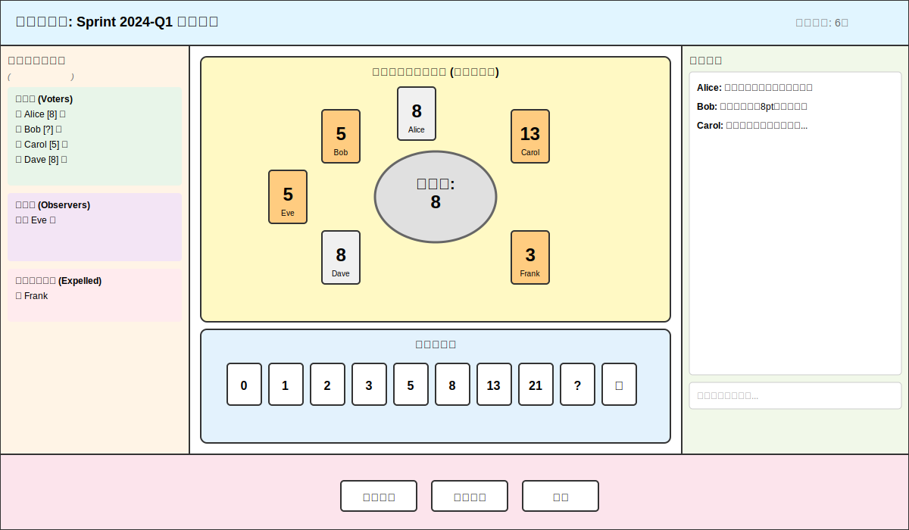
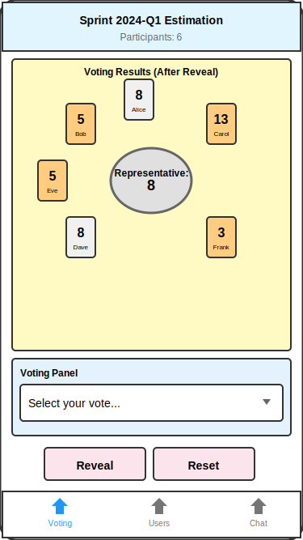
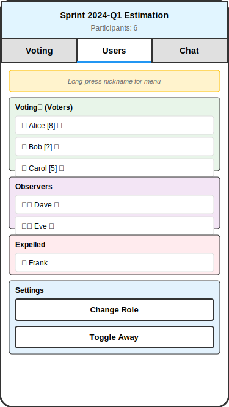
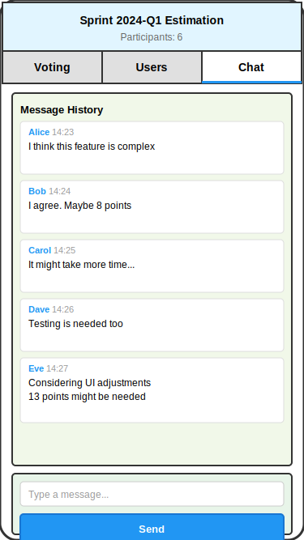

# プランニングポーカーアプリケーション仕様書 Rev.1

## 文書管理情報

- **文書バージョン**: Rev.1
- **作成日**: 2026-02-04
- **ステータス**: 初版ドラフト

## 1. 概要

### 1.1 目的

本文書は、 Web ベースのプランニングポーカーアプリケーションの仕様を定義するものである。アジャイル開発チームがストーリーポイントの見積もりを行う際に、リモート・対面問わず円滑なコミュニケーションを実現することを目的とする。

### 1.2 対象ユーザーと提供価値

#### 1.2.1 対象エンドユーザー

本アプリケーションの対象ユーザーは**開発者 (Developers)**である。

- 主語は常に Developers であり続ける
- プロダクトオーナー (PO) は原則として「観察者 (Observer)」ロールでの参加を想定
- AI は投票権を持たない (Developers が投票する際の参考情報としての利用は想定する)

#### 1.2.2 提供する価値

本アプリケーションは以下の価値を提供する：

**主たる価値: 合意形成ツール**
- 開発チーム内での見積もりに関する合意形成を支援
- 異なる視点や懸念事項を可視化し、議論を促進
- チーム全体での共通理解の構築

**副次的価値: 予測精度向上ツール**
- 複数の視点からの見積もりにより、予測精度の向上も期待できる
- 個人の見積もりバイアスを緩和
- 過去のラウンド履歴による振り返りと学習の支援

### 1.3 適用範囲

本仕様は以下を対象とする：

- Web アプリケーションのユーザーインターフェース
- テーブル管理機能
- 投票機能
- チャット・コミュニケーション機能

### 1.4 ストーリーカード

#### 1.4.1 目的

ストーリーカードは、プロダクト開発において「ユーザーの価値」にフォーカスし、プロダクトを正しい方向に進めるための重要なツールである。本節では、ストーリーカードの記述フォーマットと運用ルールを定義する。

#### 1.4.2 ストーリーカードの基本フォーマット

ストーリーカードは以下の固定フォーマットに従って記述する：

```
{role} は、 {action} したい。 {benefit} (の) ために。
```

各要素の定義は以下の通り：

- **{role}**: ユーザーロール - 後述の定義済みリストから選択
- **{action}**: 実現したいこと - 行いたい行動や操作
- **{benefit}**: 理由・価値 - なぜそれを行いたいのか

詳細な定義と考察は [User Story-Driven Development Handbook](../user-story-driven-development-handbook.md) を参照。

#### 1.4.3 定義済みユーザーロール

ストーリーカードの {role} として使用可能なユーザーロールは以下の通り：

**1. エンドユーザー関連 (最優先)**
- エンドユーザー (開発者)
- エンドユーザー (スクラムマスター)
- エンドユーザー (プロダクトオーナー)
- モバイルユーザー
- PCユーザー

**2. その他のステークホルダー (副次的)**
- プロダクトオーナー (本システムの)
- 開発チーム (本システムの)
- システム管理者
- サポート担当者

各ロールの詳細説明は付録 C を参照。

#### 1.4.4 ユーザーストーリーの管理

- ストーリーカードを含むユーザーストーリー (PBI) のリストはプロダクトバックログとして管理する
- プロダクトバックログの具体的な管理場所やツールは、プロジェクト進行に応じて決定する
- 新しいユーザーロールが必要になった場合は、本仕様書の定義済みユーザーロールリストに追加し、仕様変更として扱う

詳細は付録 C を参照。

## 2. システム概要

### 2.1 基本コンセプト

プランニングポーカーアプリケーションは、複数の参加者がリアルタイムでストーリーポイントを投票し、同時に開票 (公開) することで、チーム全体でコンセンサスを形成するためのツールである。

### 2.2 主要機能

1. **テーブル管理**: URL 単位でテーブルを作成・管理
2. **投票機能**: 参加者による秘密投票と開票
3. **チャット機能**: ラウンド単位での会話ログ管理
4. **参加者管理**: ニックネームベースの識別、接続状態監視、追い出し機能
5. **ロール・状態管理**: 投票者/観察者ロールと離席中状態

## 3. 機能要件

### 3.1 プラットフォーム対応

#### 3.1.1 対応デバイス・ブラウザ

本アプリケーションは以下のモダンブラウザをサポート対象とする：

**PC (デスクトップ):**
- Windows/Mac/Linux
- Chrome (最新版および1つ前のバージョン)
- Edge (最新版および1つ前のバージョン)
- Firefox (最新版および1つ前のバージョン)
- Safari (最新版および1つ前のバージョン)

**モバイル:**
- iOS (iPhone/iPad): Safari (最新版および1つ前のバージョン)
- Android: Chrome (最新版および1つ前のバージョン)

### 3.2 テーブル管理

#### 3.2.1 テーブルの作成

- テーブル作成時にテーブル名を入力
- テーブル作成時に一意の URL を自動生成
- URL形式: `https://[domain]/[table-id]`
- table-idは推測困難なランダム文字列 (例: UUID)

#### 3.2.2 参加者の招待

- 生成された URL を参加者に共有することで入室を促す
- URL の共有手段は任意 (Slack、メール、チャット等)
- テーブル作成者が特別な権限を持つことはない (フラットな権限構造)

#### 3.2.3 テーブル名

- テーブル作成時に任意のテーブル名を設定可能
- テーブル名は参加者全員に表示される
- テーブル名は見積もり対象やプロジェクト名などを設定することを想定
- 例: "スプリント24見積もり"、"プロジェクトX バックログ整理"

### 3.3 参加者管理

#### 3.3.1 ニックネーム識別

- 入室時にニックネームを入力
- 同一テーブル内でニックネームの一意性を保証
- 大文字小文字は区別する

#### 3.3.2 重複ニックネーム処理

同一ニックネームでの入室試行時：

- 入室を拒否し、入室画面に戻る
- メッセージ表示: 「すでに同じニックネームのユーザーが参加しています。ニックネームを変更してください」
- 入室画面での操作：
 - ニックネーム入力フィールドを強調表示
 - ニックネーム入力フィールドにフォーカスを当てる

**再接続が必要な場合:**
- 既存の接続が残っている場合は、他の参加者に追い出してもらう必要がある
- 追い出された後、同じニックネームで再度入室可能

#### 3.3.3 接続状態監視

アプリケーションは参加者の接続状態を継続的に監視する：

**接続状態の種類:**
- **アクティブ (Active)**: 接続が確立されており、正常に通信が行われている状態
- **非アクティブ (Inactive)**: 接続が切断されている、または一定時間通信がない状態

**監視方法:**
- WebSocket または類似の技術によるハートビート機能
- 一定間隔 (例: 30秒) ごとにクライアントからサーバーへ ping 送信
- タイムアウト時間 (例: 60秒) を超えて応答がない場合、非アクティブと判定

**状態の可視化:**
- 参加者一覧で各参加者の接続状態を表示
- アクティブ: 緑色のインジケーターまたは "●" マーク
- 非アクティブ: グレー色のインジケーターまたは "○" マーク

#### 3.3.4 参加者の追い出し機能

非アクティブな参加者をテーブルから退出させる機能を提供する：

**実行条件:**
- 対象参加者が非アクティブ状態である

**実行手順:**
1. 参加者一覧で各参加者のニックネーム部分をコンテキストメニュー操作
 - **PC**: 右クリックでメニュー表示
 - **モバイル**: 長押しでメニュー表示
2. コンテキストメニューに「追い出す」オプションを表示 (非アクティブな参加者のみ)
3. 「追い出す」を選択すると確認ダイアログを表示
 - メッセージ: 「[ニックネーム]さんをテーブルから追い出しますか？」
 - 選択肢: 「追い出す」「キャンセル」
4. 「追い出す」を選択すると、対象参加者をテーブルから退出させる

**追い出し後の処理:**
- 対象参加者の接続を切断
- 参加者一覧から「追い出し済み」セクションに移動
- 追い出し済みユーザーには「戻す」操作が可能
- ただし、以下は保持される：
 - 過去の投票履歴 (ラウンド履歴内)
 - チャットメッセージ履歴
 - 参加者のニックネームは履歴内に残る

**戻す操作:**
- 追い出し済みセクションに表示されているユーザーのニックネーム部分をコンテキストメニュー操作
 - **PC**: 右クリックでメニュー表示
 - **モバイル**: 長押しでメニュー表示
- コンテキストメニューに「戻す」オプションを表示
- 「戻す」をクリックすると、該当ユーザーの追い出し状態を解除
- 戻された後、そのニックネームでの再入室が可能となる

**権限:**
- すべての参加者が追い出し機能と戻す機能を実行可能 (フラットな権限構造)

#### 3.3.5 参加者ロール

以下のロールを用意し、参加者は任意のタイミングで制限なくロールを変更可能とする：

1. **投票者 (Voter)**
 - デフォルトロール
 - 投票可能
 - 開票・リセット操作可能
 - チャット参加可能

2. **観察者 (Observer)**
 - 投票できないこと以外は投票者と同じ
 - 他の参加者の投票状況・結果を閲覧可能
 - 開票・リセット操作可能
 - チャット参加可能

#### 3.3.6 参加者状態

ロールとは別に、参加者の状態を表示する機能を提供する：

- **通常**: デフォルト状態
- **離席中 (Away)**: 参加者が一時的に席を外していることを他の参加者に伝える
- 状態は参加者自身がいつでも変更可能
- 離席中の参加者も投票やチャットは可能 (制限はない)
- 他の参加者には、参加者一覧で離席中のアイコンまたはラベルが表示される

**注意:** 離席中状態は、接続状態 (アクティブ/非アクティブ) とは独立した概念である。離席中でもアクティブな接続は維持される。

### 3.4 投票機能

#### 3.4.1 ポイントスケール

以下のポイントを選択可能とする (フィボナッチ数列ベース)：

- 0, 1, 2, 3, 5, 8, 13, 21, 34+
- 特殊カード: "?" (不明), "☕" (休憩)

**注意:** 34+ は表記上は「34+」と表示するが、内部的には 34 として扱っても良い。

#### 3.4.2 投票フロー

**開票前 (秘密投票フェーズ):**
1. 各参加者が自分のポイントを選択
2. 選択したポイントは本人にのみ表示
3. 他の参加者には「投票済み」または「未投票」のステータスのみ表示
4. 投票を変更可能 (何度でも)

**開票操作:**
- どの参加者でも「開票」ボタンをクリック可能
- 開票すると全参加者の投票が一斉に公開される

**開票後 (公開フェーズ):**
1. 全参加者の投票結果が表示される
2. この時点での投票変更は即座に他の参加者に反映される
3. リアルタイム更新により、変更が即時に共有される

#### 3.4.3 リセット・開票解除機能

**リセット機能:**
- どの参加者でも「リセット」ボタンをクリック可能
- リセットにより以下が実行される：
 - 全参加者の投票をクリア
 - 秘密投票フェーズに戻る
 - 新しい「ラウンド」が開始される (チャット履歴の区切りに影響)

**開票解除機能:**
- 開票後、いつでも開票前の状態 (秘密投票フェーズ) に戻すことが可能
- 「開票解除」ボタンをクリックすることで実行
- 開票解除により以下が実行される：
 - 各参加者の投票内容は保持される
 - 投票の公開状態が解除され、再び秘密投票フェーズに戻る
 - 参加者は投票を変更可能
 - 再度開票することで、更新された投票結果を公開できる

### 3.5 視覚表現

#### 3.5.1 開票前の表示

- 自分の投票: ポイント数値をそのまま表示
- 他の参加者:
 - 投票済み: チェックマーク ✓ またはカードの背面イメージ
 - 未投票: 空のカードまたは "−" 表示

#### 3.5.2 開票後の表示

##### 3.5.2.1 参考代表値の算出

開票後、そのラウンドの**参考代表値**を以下の方法で算出する。参考代表値は合意そのものではなく、合意形成のための参照として示す値である。

1. 有効な投票者 (Voter) 全員のポイントの算術平均 (mean) を計算
2. フィボナッチ数列全体 (0, 1, 2, 3, 5, 8, 13, 21, 34, ...) の中から、算術平均に最も近いフィボナッチ数を参考代表値とする
3. 近さが同じ場合 (等距離の場合) は、大きい方の値を選択

**計算例:**
- {3, 5, 8}: 平均 = 5.33 → |5-5.33|=0.33 < |8-5.33|=2.67 → 参考代表値は 5
- {3, 8, 13}: 平均 = 8.0 → |8-8.0|=0 → 参考代表値は 8
- {2, 5, 8}: 平均 = 5.0 → |5-5.0|=0 → 参考代表値は 5
- {3, 8}: 平均 = 5.5 → |5-5.5|=0.5 < |8-5.5|=2.5 → 参考代表値は 5
- {3, 3, 3, 8, 8, 8}: 平均 = 5.5 → |5-5.5|=0.5 < |8-5.5|=2.5 → 参考代表値は 5

**注意:** フィボナッチ数列全体から最も近い値を探す。投票された値だけでなく、0, 1, 2, 3, 5, 8, 13, 21, 34 などのフィボナッチ数全体が候補となる。実際には、平均値よりも大きい最も近いフィボナッチ数と平均値よりも小さい最も近いフィボナッチ数の2つを比較すれば良い。

**特殊カード ("?" "☕") の扱い:** 参考代表値の算出およびずれ幅の計算には数値ポイントのみを用い、"?" と "☕" は対象外とする。これらの投票をしたカードの色は、色強調なし (デフォルト背景色) で表示する。

##### 3.5.2.2 ずれ幅の定義と計算

**定義:**

- **参考代表値からの距離**: 各投票値と参考代表値との差の絶対値。その投票が参考代表値からどれだけ離れているかを表す。
- **ずれ幅**: 各投票の「参考代表値からの距離」から、全投票のうち最小の距離を引いた値。参考代表値に最も近い投票のずれ幅は 0 となり、それより遠い投票ほどずれ幅が大きくなる。色付けでは「その投票が、参考代表値に最も近い人たちに比べてどれだけ遠いか」を表す。

**ずれ幅の計算アルゴリズム (Python 実装例):**

```python
def calc_deviation_widths(votes):
    """
    投票リストから各投票のずれ幅を計算する。

    Args:
        votes: 投票値のリスト (例: [2, 2, 2, 5, 8, 8, 8])

    Returns:
        各投票のずれ幅のリスト (参考代表値からの距離の最小値との差)
    """
    fib_list = [0, 1, 2, 3, 5, 8, 13, 21, 34, 55, 89]

    # 算術平均を計算
    mu = sum(votes) / len(votes)

    # 平均に最も近いフィボナッチ数を参考代表値として選択
    # 同距離の場合は大きい方を選択 (負の符号を使ったソート)
    ref_rep = -min((abs(x - mu), -x) for x in fib_list)[1]

    # 各投票の参考代表値からの距離を計算
    distances = [abs(v - ref_rep) for v in votes]

    # 最小距離を基準として、各投票のずれ幅を計算
    min_distance = min(distances)
    deviation_widths = [d - min_distance for d in distances]

    return deviation_widths
```

**具体例 (ずれ幅の計算):**

*例1: {2, 2, 2, 8, 8, 8}* — 全員が参考代表値から等距離のケース
- 平均 = (2×3 + 8×3) / 6 = 30/6 = 5.0
- 参考代表値: 5
- 各投票の参考代表値からの距離: 2→|2-5|=3, 8→|8-5|=3
- 最小距離: 3
- ずれ幅: 2→0, 8→0
- **判定**: 全員のずれ幅が 0 → 全員が色強調なし

*例2: {2, 2, 2, 5, 8, 8, 8}* — 参考代表値に一致する投票があるケース
- 平均 = (2×3 + 5 + 8×3) / 7 = 35/7 = 5.0
- 参考代表値: 5
- 各投票の参考代表値からの距離: 2→|2-5|=3, 5→|5-5|=0, 8→|8-5|=3
- 最小距離: 0
- ずれ幅: 2→3, 5→0, 8→3
- **判定**:
 - 5: ずれ幅 0 → 色強調なし
 - 2: ずれ幅 3 → オレンジ系
 - 8: ずれ幅 3 → オレンジ系

*例3: {2, 8}* — 全員が参考代表値から等距離のケース
- 平均 = (2 + 8) / 2 = 5.0
- 参考代表値: 5
- 各投票の参考代表値からの距離: 2→|2-5|=3, 8→|8-5|=3
- 最小距離: 3
- ずれ幅: 2→0, 8→0
- **判定**: 全員のずれ幅が 0 → 全員が色強調なし

*例4: {3, 5, 8, 13}*
- 平均 = (3 + 5 + 8 + 13) / 4 = 29/4 = 7.25
- 参考代表値: 8 (|8-7.25|=0.75 < |5-7.25|=2.25)
- 各投票の参考代表値からの距離: 3→|3-8|=5, 5→|5-8|=3, 8→|8-8|=0, 13→|13-8|=5
- 最小距離: 0
- ずれ幅: 3→5, 5→3, 8→0, 13→5
- **判定**:
 - 8: ずれ幅 0 → 色強調なし
 - 5: ずれ幅 3 → オレンジ系
 - 3: ずれ幅 5 → オレンジ系
 - 13: ずれ幅 5 → オレンジ系

##### 3.5.2.3 ずれ幅に基づくカードの色分け

カードの色は、各投票の**ずれ幅**を視覚化する。ずれ幅が 0 のカードは色強調なしとし、ずれ幅が大きいほど「参考代表値に近い人たちに比べて、その投票は少し遠くにある」ことが分かるように色を付ける。

**色の実装方針 (連続する色直線上の離散点):**

色は、連続する色直線 (例: デフォルト背景 → 薄黄 → オレンジ → 赤) 上の**離散点**を参照する形で実装する。ずれ幅の値に応じて、その直線上で定義した離散的な色 (または CSS クラス) を選び、カードに適用する。これにより、テーマ切替 (ライト/ダーク) やアクセシビリティ対応時も、同じ離散点の定義を維持しつつ色だけを差し替えやすい。

**色分けルール (離散点の例):**
- **ずれ幅 0 (参考代表値に最も近いグループ)**: 色強調なし (デフォルト背景色)
- **ずれ幅 1-2**: 薄い黄色系
- **ずれ幅 3-5**: オレンジ系
- **ずれ幅 6以上**: 赤系

**投票結果の表示レイアウト**

開票後は、以下のようなレイアウトで投票結果を表示する：

- **テーブル中央**: 参考代表値を表示 (例: 「参考代表値: 5」)
- **カード配置**: テーブルを囲むようにカードを配置
- **ユーザー識別**: 各カードの近くにユーザーニックネームを表示
- **視覚的配置**:
 - 参加者が実際のテーブルを囲んで座っているイメージ
 - カードは円形または楕円形の配置で、テーブルの周囲に等間隔で配置
 - 各カードには投票したポイント数を表示
 - カードの色はずれ幅に応じて上記ルール (連続色直線上の離散点) に従う

**表示例 (概念図):**

例として {3, 5, 5, 8, 8, 13} の投票を想定：
- 平均 = (3 + 5×2 + 8×2 + 13) / 6 = 42/6 = 7.0
- 参考代表値: 8 (|8-7.0|=1.0 < |5-7.0|=2.0)
- 参考代表値からの距離: 3→5, 5→3, 8→0, 13→5
- ずれ幅: 3→5, 5→3, 8→0, 13→5

```
        [Alice: 8]
   [Bob: 5] (オレンジ)   [Carol: 13] (オレンジ)
      
     参考代表値: 8
      
   [Dave: 8]   [Eve: 5] (オレンジ)
        [Frank: 3] (オレンジ)
```

この配置により、チーム全体の投票状況と合意形成の度合いを一目で把握でき、対面でのプランニングポーカーに近い体験を提供する。

#### 3.5.3 統計情報の表示

開票後は以下の統計情報も表示する：

- **参考代表値**: 算術平均から算出された最も近いフィボナッチ数 (このラウンドの参照値)
- **平均値**: 全投票者のポイントの算術平均
- **中央値**: 全投票値の中央値
- **最頻値**: 最も多く投票されたポイント
- **最小値・最大値**: 投票範囲
- **合意度**: 標準偏差等 (ずれ幅の大きさを数値で表現)

参考代表値はテーブル中央に大きく表示し、チームの合意形成の目安として活用する。

### 3.6 チャット機能

#### 3.6.1 基本機能

- リアルタイムテキストチャット
- 全参加者が発言可能 (観察者含む)
- タイムスタンプ付きメッセージ表示
- 発言者のニックネーム表示

#### 3.6.2 ラウンド単位の履歴管理

**ラウンドの概念:**
- 1回のリセットから次のリセットまでを1つの「ラウンド」とする
- 各ラウンドは見積もり対象 (ストーリー、タスク等) に対応

**ラウンドタイトル:**
- 各ラウンドには任意でタイトルを設定可能
- ラウンドタイトルは手動で入力するオプショナルなテキストボックスで入力
- いつでも変更可能
- リセット時にダイアログは表示しない
- 自動抽出は行わない

**ラウンドごとの情報:**
- チャット履歴
- 最終的な投票結果
- 参考代表値 (そのラウンドの参照フィボナッチ値)
- ラウンドタイトル (設定されている場合)
- 開始時刻・終了時刻 (リセットまたはテーブル終了)

**履歴の利用:**
- 過去のラウンドを参照可能
- 「ラウンド1」「ラウンド2」...と番号で管理
- 任意のラウンドにタイトル付与可能 (例: "US-1234: ユーザーログイン機能")

#### 3.6.3 プランニング対象の共有

チャットでの共有を想定する情報：
- チケット識別子 (例: JIRA-1234、GitHub Issue #123)
- チケット URL
- 要件・仕様の概要
- 技術的な懸念事項
- 見積もりの根拠

### 3.7 リアルタイム通信

本アプリケーションはリアルタイム双方向通信を必要とする。具体的な技術選定は仕様確定後の技術選定フェーズで行う。

#### 3.7.1 要件
- 参加者の入退室をリアルタイムで通知
- 投票状況の変化をリアルタイムで反映
- チャットメッセージの即時配信
- ロール変更・状態変更のリアルタイム反映
- 接続状態監視のためのハートビート機能
 - クライアントから定期的に ping を送信
 - サーバーがタイムアウトを検知し、接続状態を更新

#### 3.7.2 接続断時の挙動

- 一時的な接続断時は自動再接続を試行
- 再接続成功時は現在の状態を復元
- 長時間の接続断後 (非アクティブ状態) は、他の参加者による追い出し後に再入室が可能

## 4. 非機能要件

### 4.1 パフォーマンス (案・仕様確定後に再検証)

- 初回ページ読み込み: 3秒以内
- 投票反映の遅延: 500ms以内
- チャットメッセージ配信遅延: 1秒以内
- 同時接続ユーザー: テーブルあたり最大50名を想定

### 4.2 セキュリティ

- HTTPS 通信の必須化
- table-idの推測困難性確保
- XSS・CSRF 対策の実装

**セキュリティポリシー:**
本アプリケーションは、参加者間の軽量な識別を目的としており、厳密なユーザー認証は実装しない。ニックネームベースの識別と追い出し機能による簡易的な管理とする。プランニングポーカーという用途の性質上、悪意のある第三者による攻撃を想定した高度なセキュリティ対策は行わない。

### 4.3 可用性

- テーブルデータの永続化 (サーバー再起動時も維持)
- データ保持期間: 最終アクティビティから24時間

### 4.4 ユーザビリティ

- 直感的な UI/UX設計
- レスポンシブデザイン対応
- アクセシビリティ対応 (WCAG 2.1 AA準拠を推奨)
- ダークモード対応

### 4.5 インフラストラクチャーおよびデプロイメント

#### 4.5.1 Infrastructure as Code (IaC) の最大化

本アプリケーションの開発・運用においては、**インフラストラクチャーを可能な限り IaC (Infrastructure as Code) でコントロール**することを前提とする。

**基本方針:**

1. **IaC 管理の徹底とプログラミングの最小化**
 - インフラストラクチャーの構成、設定、デプロイメントは原則としてコード化する
 - **定義 (Definition) によるコントロールのみとし、プログラミングは極力避ける**
 - 手動での設定変更は極力避け、すべての変更を原則 IaC を通じて行う
 - IaC ツール例: Terraform、AWS CloudFormation、Pulumi、AWS CDK 等

2. **サーバーレスアーキテクチャの優先**
 - **バックエンドはサーバーレス (serverless) が理想**
 - サーバープログラムコードの実装を極力避ける
 - マネージドサービスと IaC による定義のみでコントロールすることを望む
 - カスタムサーバーコードが必要な場合も、最小限に留める

3. **技術選定における IaC 対応の優先**
 - サービスや技術の選定時には、IaC での管理が容易であることを重視する
 - IaC で完全に管理可能なサービスを優先的に採用する
 - マネージドサービスの利用時も、IaC によるプロビジョニングと設定管理が可能であることを確認する

4. **コスト最適化とサーバーレス優先**
 - 小規模利用時に無料枠で収まる可能性が高いサービスを優先的に採用する
 - 常時起動の固定費用が発生するサービスよりも、従量課金型のサービスを優先する
 - ホスト管理が必要なサービスよりも、サーバーレス (serverless) やマネージド (managed) サービスを優先する
 - 例: EC2 インスタンスよりも Lambda や Fargate、自己管理データベースよりも RDS や DynamoDB 等

5. **バージョン管理とレビュー**
 - すべての IaC コードは Git 等のバージョン管理システムで管理する
 - インフラ変更は Pull Request を通じてレビューを実施する
 - 変更履歴を追跡可能にし、必要に応じてロールバック可能な状態を維持する

6. **再現性の確保**
 - IaC により、環境の再構築を自動化・標準化する
 - 開発環境、ステージング環境、本番環境の差異を最小化する
 - ディザスタリカバリー時にも迅速に環境を再構築できるようにする

#### 4.5.2 IaC で管理できない部分の対応

一部のインフラストラクチャー要素は、技術的制約により IaC で完全に管理できない場合がある (例: クラウドプラットフォームアカウントの新規作成、初期ルートユーザー設定、一部の組織レベルの設定等)。このような要素については、以下の方針で対応する：

**手順ドキュメントの整備:**

IaC で管理できない手順については、**手厚い手順ドキュメントを用意し、再現性を最大限確保する**。

1. **具体的な項目名の記載**
 - ドキュメント作成時点でのサービスの UI や設定項目名を具体的に記載する
 - 例: 「AWS Management Console にログイン後、右上のアカウント名をクリックし、プルダウンメニューから『マイアカウント』を選択」

2. **「何をどうする」の併記**
 - 具体的な項目名だけでなく、**その操作が何を目的としているか、どのような設定をしようとしているか**を併記する
 - これにより、サービスのアップデートで UI や項目名が変わっても、目的から適切な操作を推測できるようにする
 - 例:
 - 「『マイアカウント』(アカウント設定画面) を選択」
 - 「MFA (多要素認証) を有効化する設定項目を探し、有効化を実行」
 - 「目的: ルートユーザーのセキュリティを強化するため、SMS または認証アプリによる多要素認証を設定する」

3. **構造変化への対応**
 - サービスのメニュー構造や設定画面の構成が変わることを想定する
 - 「どのセクションのどの機能にアクセスするか」を目的ベースで記述する
 - スクリーンショットを含める場合は、撮影日時を明記し、参考情報であることを明示する

4. **ドキュメントのメンテナンス**
 - 手順ドキュメントは定期的にレビューし、サービスの変更に追従することが望ましい
 - 実行時に不整合を発見した場合は、可能な限り速やかにドキュメントを更新する
 - 更新履歴をドキュメント内に記録することを推奨する (最終確認日、最終更新日等)

**例: AWS アカウント作成手順ドキュメントの記載イメージ**

```
## AWS アカウントの新規作成

**目的**: 本アプリケーションをデプロイするための AWS アカウントを新規に作成する。

**手順**:

1. AWS アカウント作成ページにアクセス
   - 具体的な URL: https://aws.amazon.com/jp/
   - 目的: 新規 AWS アカウントを作成するためのエントリーポイント

2. 「AWS アカウントを作成」ボタンをクリック
   - 2026年2月時点では、トップページ右上に「アカウント作成」ボタンがある
   - 目的: 新規アカウント作成フローを開始する

3. メールアドレスとアカウント名を入力
   - 入力項目: 「E メールアドレス」「AWS アカウント名」
   - 目的: アカウントの識別情報を登録する
   - 推奨: 個人利用の場合は個人のメールアドレス、チーム利用の場合は共有メールアドレスを使用

4. (以下、手順を続ける...)

**最終確認日**: 2026-02-04
**注意**: UI は変更される可能性があります。項目名が異なる場合は、「目的」の記載を参考に適切な操作を行ってください。
```

#### 4.5.3 推奨されるアプローチ

**IaC 最大化のためのサービス選定例:**

- **コンピューティング**: AWS ECS (Fargate)、AWS Lambda、Google Cloud Run 等、完全にコード定義可能なサービス
- **データベース**: Amazon RDS、Amazon DynamoDB 等、IaC でプロビジョニング・設定可能なマネージドサービス
- **ネットワーキング**: VPC、サブネット、セキュリティグループ等、すべて IaC で定義
- **監視・ロギング**: CloudWatch、Cloud Logging 等、IaC で設定可能なサービス
- **CI/CD**: GitHub Actions、AWS CodePipeline 等、YAML や IaC で定義可能なサービス

**避けるべきアプローチ:**

- コンソールでの手動設定に依存するサービス
- IaC ツールのサポートが不十分なサービス
- 設定のエクスポート・インポート機能が提供されていないサービス

## 5. ユーザーインターフェース

### 5.1 画面構成

#### 5.1.1 ランディングページ (テーブル作成画面)
- テーブル名入力フィールド
- 新規テーブル作成ボタン
- URL 経由での参加のみをサポート (個別の table-id 入力フィールドは設けない)

#### 5.1.2 入室画面
- ニックネーム入力フィールド
 - **ローカルストレージに前回のニックネームを保存**
 - 次回訪問時、入力フィールドに自動フィル (ユーザーは変更可能)
- ロール選択 (投票者/観察者)

#### 5.1.3 メイン画面

**レイアウト:**
- 上部: テーブル情報 (テーブル名、参加者数)
- 中央: 参加者一覧と投票状況
 - **ユーザーリスト UI コンポーネント**:
 - **投票者 (Voters)** セクション: 投票権を持つ参加者をグループ化して表示
 - **観察者 (Observers)** セクション: 観察者ロールの参加者をグループ化して表示
 - **追い出し済み (Expelled)** セクション: 追い出されたユーザーをグループ化して表示
 - 各参加者のロール、状態 (離席中)、接続状態 (アクティブ/非アクティブ) を表示
 - **参加者操作**: ユーザーニックネーム部分のコンテキストメニュー (PC: 右クリック、モバイル: 長押し) から「追い出す」「戻す」などの操作が可能
- 中央: 投票結果表示エリア (開票後)
 - テーブルを囲むようにカードを配置
 - 各カードの近くにユーザーニックネームを表示
 - 色分けでポイントの大きさを視覚的に表現
- 下部: 自分の投票パネル (ポイントカード選択)
- 右側または下部: チャットエリア
- 操作ボタン: 開票、開票解除、リセット
- ユーザー設定: ロール変更、状態変更 (離席中切り替え)

#### 5.1.4 メイン画面レイアウトモックアップ

レイアウトモックアップは、 SVG 形式で提供しています。 GitHub のファイルブラウザー上で直接確認できます。

##### PC版レイアウト

PC版では、横長レイアウトでユーザーリストとチャットを左右に配置。**投票結果エリアではカードがテーブル (代表値) を囲むように円形配置**されます：



**主要エリア:**
- **ヘッダー**: テーブル名と参加者数を表示
- **左パネル (ユーザーリスト)**: 
 - 投票者セクション (緑背景)
 - 観察者セクション (紫背景)
 - 追い出し済みセクション (赤背景)
 - ユーザー操作: ニックネーム部分を右クリックでコンテキストメニュー
- **中央パネル**: 
 - **投票結果表示エリア** (開票後): 
 - **テーブルを囲むようにカードを円形配置** (重要な視覚表現)
 - 中央の楕円がテーブルを表現
 - カードは参加者が実際のテーブルを囲んで座っているイメージ
 - 代表値をテーブル中央に表示
 - 各カードの色は乖離度を表現 (乖離0=灰、小=黄、中=橙、大=赤)
 - 投票パネル (0, 1, 2, 3, 5, 8, 13, 21, ?, ☕)
- **右パネル (チャット)**: 
 - メッセージ履歴
 - メッセージ入力フィールド
- **フッター (操作ボタン)**: 開票、リセット、設定

**カラースキーム:**
- ヘッダー: 水色系 (#e1f5ff)
- ユーザーリスト: ベージュ系 (#fff4e6)
- 投票結果エリア: 薄黄色系 (#fff9c4)
- 投票パネル: 薄青系 (#e3f2fd)
- チャット: 薄緑系 (#f1f8e9)
- 操作ボタン: ピンク系 (#fce4ec)

##### モバイル版レイアウト

モバイル版では、タブで画面を切り替える縦型レイアウト：

**タブ1: 投票タブ**



- ヘッダー: テーブル名と参加者数
- タブナビゲーション: [Voting] [Users] [Chat]
- **投票結果表示エリア**: 
 - **PC版と同様、テーブルを囲むようにカードを円形配置**
 - 中央の楕円がテーブルを表現
 - 代表値をテーブル中央に表示
 - 各カードの色は乖離度を表現
- **投票パネル**: ドロップダウン (単一選択 select) でポイント選択
- 操作ボタン: Reveal、Reset

**注**: モックアップは初版対応言語 (英語) で作成されています。

**タブ2: ユーザータブ**



- ヘッダーとタブナビゲーション
- 投票者セクション: 緑背景、投票状況表示
- 観察者セクション: 紫背景
- 追い出し済みセクション: 赤背景
- 設定セクション: ロール変更、離席中切替ボタン

**タブ3: チャットタブ**



- ヘッダーとタブナビゲーション
- チャット履歴エリア: スクロール可能なメッセージリスト
- メッセージ入力エリア: 入力フィールドと送信ボタン

**レイアウト説明:**
- **PC版**: 
 - ユーザーリストは左側、投票結果は中央、チャットは右側に配置
 - ユーザー操作: ニックネーム部分を右クリックでコンテキストメニュー
 - ユーザーリストは3つのセクションに分割
 - **投票結果は円形配置でテーブルを囲むイメージ** (重要):
 - 中央の楕円がテーブルを表現
 - カードはテーブルの周囲に配置
 - 参加者が実際のテーブルを囲んで座っているような視覚表現
 - テーブル中央に代表値を表示
- **モバイル版**: 
 - 3つのタブ (Voting/Users/Chat) で画面切り替え
 - ユーザー操作: ニックネーム部分を長押しでコンテキストメニュー
 - **投票タブ**: 
 - PC版と同じく、テーブルを囲むようにカードを円形配置
 - 投票パネルはドロップダウン (単一選択 select) でポイント選択
 - 参加者簡易状況表示は廃止
 - ユーザータブで詳細な参加者管理
 - チャットタブで会話履歴を表示
- **投票結果表示**: 
 - **テーブルを囲むようにカード配置** (コアコンセプト)
 - テーブル中央に代表値を大きく表示
 - 各カードの近くにユーザーニックネーム
 - カード色は乖離度を視覚化 (乖離0→薄黄→橙→赤)
 - 🟢 アクティブ、🟡 離席中、🔴 非アクティブ (接続状態)

**注**: モックアップはすべて初版対応言語 (英語) で作成されています。

### 5.2 レスポンシブデザイン

**PC (デスクトップ):**
- 横長レイアウト
- 参加者一覧とチャットを左右または上下に配置

**モバイル (スマートフォン):**
- 縦長レイアウト
- タブまたはスワイプで投票エリアとチャットを切り替え

**タブレット:**
- 画面サイズに応じてPCまたはモバイルレイアウトを適用

## 6. データモデル (案・仕様確定後に再検証)

### 6.1 テーブル (Table)

```
Table {
  tableId: string (UUID)
  tableName: string
  createdAt: timestamp
  lastActivityAt: timestamp
  participants: Participant[]
  currentRound: Round
  roundHistory: Round[]
}
```

### 6.2 参加者 (Participant)

```
Participant {
  nickname: string
  role: "voter" | "observer"
  status: "normal" | "away"
  connectionStatus: "active" | "inactive"
  connectedAt: timestamp
  lastActivityAt: timestamp
}
```

### 6.3 ラウンド (Round)

```
Round {
  roundId: number (sequential)
  title: string (optional)
  startedAt: timestamp
  endedAt: timestamp (optional)
  isRevealed: boolean
  votes: Vote[]
  referenceRepresentativeValue: number (optional, 参考代表値, フィボナッチ数, 開票後に算出)
  chatMessages: ChatMessage[]
}
```

### 6.4 投票 (Vote)

```
Vote {
  participantNickname: string
  point: 0 | 1 | 2 | 3 | 5 | 8 | 13 | 21 | 34 | "?" | "☕"
  votedAt: timestamp
  updatedAt: timestamp
}
```

### 6.5 チャットメッセージ (ChatMessage)

```
ChatMessage {
  messageId: string (UUID)
  participantNickname: string
  message: string
  timestamp: timestamp
}
```

## 7. 技術スタック

技術スタックの選定は仕様確定後の技術選定フェーズで行う。本セクションは参考情報として記載する。

### 7.1 フロントエンド (参考)

- **フレームワーク**: React、Vue.js、または Svelte
- **状態管理**: Redux、Vuex、または Zustand
- **UI ライブラリ**: Material-UI、Ant Design、または Chakra UI
- **リアルタイム通信**: Socket.IO クライアント、またはネイティブ WebSocket API

### 7.2 バックエンド (参考)

**理想的なアプローチ:**
- **サーバーレス (Serverless) アーキテクチャが理想**
 - サーバープログラムコードの実装を極力避ける
 - マネージドサービスと IaC (Infrastructure as Code) による定義のみでコントロール
 - プログラミングは必要最小限に留める方針

**具体的な選択肢:**
- **言語**: Node.js (TypeScript)、Python、またはGo
- **フレームワーク**: Express.js、FastAPI、または Gin (サーバープログラムが必要な場合)
- **サーバーレスオプション**: AWS Lambda、Google Cloud Functions、Azure Functions
- **リアルタイム通信**: AWS AppSync (GraphQL subscriptions)、Firebase Realtime Database、または WebSocket ライブラリ
- **データストア**: DynamoDB、Firestore (サーバーレス)、Redis (テーブルデータ)、PostgreSQL (永続化オプション)

### 7.3 インフラ (参考)

- **ホスティング**: Vercel、Netlify、AWS、または GCP
- **CDN**: CloudFlare、AWS CloudFront
- **監視**: Sentry、LogRocket

## 8. 開発フェーズ (案・仕様確定後に再検証)

### Phase 1: MVP (最小実行可能プロダクト)
- テーブル作成・参加 (テーブル名機能含む)
- 基本的な投票機能 (開票・リセット)
- シンプルな UI
- 参加者管理 (ニックネーム識別、接続状態監視、追い出し機能)
- ロール機能 (投票者/観察者)

### Phase 2: チャット機能
- リアルタイムチャット
- ラウンド単位の履歴管理
- ラウンドタイトル機能
- 過去ラウンドの参照機能

### Phase 3: 高度な機能
- 離席中状態機能
- 視覚的な投票結果表現の強化
- モバイル最適化
- ダークモード対応

### Phase 4: 国際化対応
- 多言語サポート (日本語、英語など)

### Phase 5: 運用・改善
- パフォーマンス最適化
- セキュリティ強化
- ユーザーフィードバック対応

## 9. 懸念事項

### 9.1 技術的懸念

1. **リアルタイム通信のスケーラビリティ**
 - 大量の同時テーブルが発生した場合の負荷対策
 - WebSocket 接続数の上限
 - 対策: ロードバランサー、水平スケーリング、 WebSocket 専用サーバーの検討

2. **モバイルデバイスでの WebSocket 接続安定性**
 - バックグラウンド移行時の接続維持
 - ネットワーク切り替え時の再接続
 - 対策: ハートビート機能、自動再接続ロジックの実装

3. **テーブルデータの永続化方法**
 - メモリ内データストア (Redis) のみか、 RDBMS との併用か
 - データ保持期間の管理方法

### 9.2 UX/UI 懸念

1. **モバイルでの操作性**
 - 小さい画面でポイント選択やチャット入力がしやすいか
 - 対策: タッチフレンドリーな UI 設計、適切なフォントサイズ

2. **開票前後の状態遷移の明確さ**
 - ユーザーが現在どのフェーズにいるかを視覚的に理解できるか
 - 対策: 明確な状態表示、色分け、アニメーション

3. **ロールと状態の使い分けの明確さ**
 - 投票者/観察者ロールと、通常/離席中状態の違いをユーザーが理解できるか
 - 対策: 明確なラベリング、ヘルプテキスト

4. **接続状態と離席中状態の区別**
 - アクティブ/非アクティブ (接続状態) と、通常/離席中 (ユーザー設定状態) の違いをユーザーが理解できるか
 - 対策: 異なる視覚表現 (色、アイコン)、ヘルプテキスト

5. **追い出し機能の誤操作防止**
 - 誤って参加者を追い出してしまうリスク
 - 対策: 確認ダイアログの明確な表示、元に戻す方法の案内

### 9.3 セキュリティ懸念

**本アプリケーションは軽量な認証を採用しており、以下のセキュリティ懸念は受容する：**

1. **ニックネームのなりすまし**
 - 追い出された後、同じニックネームで入室することで他人になりすます可能性
 - 本アプリの性質上、簡易的な識別レベルで運用
 - 悪意のある攻撃は想定しない

2. **table-idの推測可能性**
 - UUID v4を使用すれば十分な強度があると判断
 - 対策: UUID v4またはそれに準ずるランダム生成

3. **チャットメッセージの検証**
 - XSS 攻撃への対策
 - 対策: サニタイゼーション、CSP (Content Security Policy)

4. **悪意のある追い出し行為**
 - 参加者が故意に他の参加者を追い出す可能性
 - 対策: フラットな権限構造のため、全員が追い出し可能。テーブルの URL を知る信頼できるメンバーのみで使用することを前提とする

### 9.4 運用懸念

1. **古いテーブルのクリーンアップ**
 - いつ、どのようにテーブルデータを削除するか
 - 対策: 定期的なバッチジョブ、TTL (Time To Live) 設定

2. **監視・ロギング**
 - エラー検知、パフォーマンス監視の方法
 - 対策: APM ツール導入、構造化ログ

3. **ユーザーサポート**
 - 問い合わせ対応の体制
 - FAQ の整備

## 10. 未確定事項

### 10.1 機能面

**確定済み事項:**
- ポイントスケールのカスタマイズ: **非対応**
- 自動開票機能: **非対応**
- 投票の匿名性オプション: **非対応**
- ラウンドタイトル: **手動入力 (いつでも変更可能)、リセット時ダイアログ非表示、自動抽出なし**
- 投票結果のエクスポート機能: **初期は未対応、将来対応予定**
 - CSV、JSON 形式でのエクスポート
 - Jira、GitHub 等への連携機能
- 投票者の上限人数: **10名**
 - 一般的な開発チームサイズを考慮
 - 観察者の上限は設けない

**未確定事項:**

1. **テーブルの永続化オプション**
 - ユーザーアカウント機能を追加し、過去のテーブルを保存するか？
 - ゲストテーブル (アカウント不要) とアカウントテーブルの2つのモード？

### 10.2 UI/UX面

**確定済み事項:**
- ダークモード対応: **実施する**
- 国際化 (i18n) 対応: **実施する (後で追加でOK)**
 - **初期リリース**: 英語のみ、言語切り替え不可
 - **将来の多言語対応**:
 - まず日本語に対応
 - ブラウザー言語設定をもとにデフォルト言語を導出
 - アプリ内でユーザーが好みの言語を選択可能 (ブラウザー言語によらず)
 - 言語設定はローカルストレージに保存し、次回訪問時に適用
- カスタムテーマ: **非対応**

**未確定事項:**

1. **通知機能**
 - ブラウザ通知 (開票された時、メンションされた時等)
 - **可能であれば対応したい**

### 10.3 技術面

**確定済み事項:**
- 認証・認可: **ニックネームベースの識別のみ (パスコード廃止、 OAuth 連携は不要)**

**未確定事項:**

1. **接続状態監視のパラメータ**
 - ハートビート間隔 (例: 30秒)
 - タイムアウト時間 (例: 60秒)
 - 最適な値の決定

2. **データベースの選定**
 - Redis のみで運用するか？
 - PostgreSQL 等の RDBMS を併用するか？
 - テーブルデータの長期保存が必要になった場合の対応？

3. **ホスティング環境**
 - サーバーレス (Vercel、Netlify) で運用可能か？
 - WebSocket サーバーを別途用意する必要があるか？

4. **負荷テスト**
 - 同時接続数、メッセージ送信頻度の限界値は？
 - 負荷テストツール・手法の選定

### 10.4 ビジネス・運用面

**確定済み事項:**
- 収益化モデル: **無料提供**
- 個人情報の取り扱い: **個人情報は取り扱わない。ニックネームやチャットメッセージはユーザー責任で個人情報を含まないこと前提。こちらから個人情報を問い合わせることはない**

**未確定事項:**

1. **利用規約・プライバシーポリシー**
 - データの保存期間、削除ポリシーの明文化

2. **サポート体制**
 - 問い合わせフォーム、FAQ、ドキュメントの整備
 - コミュニティフォーラムの設置

## 11. 次のアクション

### 11.1 仕様確定のためのアクション

1. **未確定事項の決定**
 - ステークホルダーレビューを実施
 - 優先順位付けと初期リリース範囲の確定

2. **プロトタイプ作成**
 - 主要画面のモックアップ作成 (Figma、Adobe XD等)
 - ユーザーからのフィードバック収集

3. **技術検証 (PoC)**
 - リアルタイム通信ライブラリの選定と検証
 - 画面共有モードでの Hide 投票の実現可能性検証
 - スケーラビリティテスト

### 11.2 設計フェーズ

1. **詳細設計書の作成**
 - API 仕様書 (RESTful API、WebSocket API)
 - データベーススキーマ設計
 - コンポーネント設計 (フロントエンド)

2. **アーキテクチャ設計**
 - システム構成図
 - デプロイメント設計
 - セキュリティ設計

### 11.3 開発準備

1. **開発環境のセットアップ**
 - リポジトリ作成
 - CI/CDパイプライン構築
 - コーディング規約の策定

2. **タスク分解とスプリント計画**
 - バックログ作成
 - ストーリーポイント見積もり
 - Phase 1 (MVP) の詳細タスク定義

---

## 付録 A: 用語集

- **プランニングポーカー**: アジャイル開発手法の一つで、チームメンバーがストーリーポイントを見積もる際に使用する手法
- **ストーリーポイント**: ユーザーストーリーやタスクの相対的な大きさを表す単位
- **ユーザーストーリー (PBI)**: 開発時に管理される単位。Product Backlog Item とも呼ばれる。ストーリーカードを含み、受け入れ条件やタスク分解なども含まれる
- **ストーリーカード**: ユーザーストーリーを記述するための記法・情報。「{role} は、 {action} したい。 {benefit} (の) ために。」という固定フォーマットで記述される。単体では管理せず、ユーザーストーリー/PBI の一部として扱う
- **ユーザーロール**: ストーリーカードにおける {role} の要素。ストーリーの主語となるユーザーの立場や役割を表す。定義済みリストから選択する
- **プロダクトバックログ**: ユーザーストーリー (PBI) のリスト。プロダクトに実装すべき機能や改善を優先順位付けして管理する
- **開票**: 参加者全員の投票を一斉に公開する操作
- **テーブル (Table)**: プランニングポーカーを実施する仮想的な「部屋」。従来は「セッション」や「テーブル」と呼ばれることもあるが、本仕様では用語の混乱を避けるため「テーブル」に統一
- **ラウンド (Round)**: 1回の見積もり対象 (リセット間の期間)。従来は「トピック」と呼ばれることもある
- **フィボナッチ数列**: 0, 1, 2, 3, 5, 8, 13, 21...と続く数列。プランニングポーカーでポイントスケールとして使用される
- **参考代表値**: 開票後、投票の算術平均に最も近いフィボナッチ数。合意そのものではなく、合意形成のための参照として示す値
- **ずれ幅**: 各投票の「参考代表値からの距離」から最小距離を引いた値。参考代表値に最も近い投票のずれ幅は 0。カードの色分けに用いる
- **投票者 (Voter)**: 投票可能な参加者ロール
- **観察者 (Observer)**: 投票はせず、閲覧のみ行う参加者ロール
- **離席中 (Away)**: 参加者が一時的に席を外していることを示す状態

## 付録 B: 参考資料

- [Scrum Guide](https://scrumguides.org/)
- [Planning Poker Wikipedia](https://en.wikipedia.org/wiki/Planning_poker)
- WebSocket RFC 6455
- WCAG 2.1 Guidelines

## 付録 C: 本プロジェクト固有のユーザーロール定義

本節では、本プロジェクト (プランニングポーカーアプリケーション) に固有のユーザーロールの詳細を記述する。

ストーリーカードとユーザーストーリーに関する一般的・汎用的な概念については、[User Story-Driven Development Handbook](../user-story-driven-development-handbook.md) を参照。

### ユーザーロールの詳細説明

#### 1. エンドユーザー関連 (最優先)

**エンドユーザー (開発者)**: 本アプリケーションの主要な利用者である開発者
- プランニングポーカーに参加し、見積もりを行う
- 投票者 (Voter) として最も頻繁に利用する
- 本アプリケーションにおける最も重要なユーザーロール

**エンドユーザー (スクラムマスター)**: チームのファシリテーター役
- セッションの進行やチームの合意形成をサポートする
- 主に投票者または観察者として参加する

**エンドユーザー (プロダクトオーナー)**: 製品の責任者
- 主に観察者 (Observer) として参加する
- ストーリーの背景説明や質問への回答を行う

**モバイルユーザー**: モバイル端末 (スマートフォン、タブレット) から利用するユーザー
- 外出先や移動中など、PCを使用できない環境での利用を想定
- タッチ操作に最適化された UI や、画面サイズに応じた表示が必要
- エンドユーザー (開発者、スクラムマスター、プロダクトオーナー) と組み合わせて考慮する

**PCユーザー**: デスクトップ・ラップトップPCから利用するユーザー
- オフィスや自宅など、固定された環境での利用を想定
- マウス・キーボード操作に最適化された UI や、広い画面領域を活用した表示が可能
- エンドユーザー (開発者、スクラムマスター、プロダクトオーナー) と組み合わせて考慮する

#### 2. その他のステークホルダー (副次的)

**プロダクトオーナー (本システムの)**: 本プランニングポーカーアプリケーション自体のプロダクトオーナー
- システムの方向性や優先順位を決定する
- エンドユーザーの価値を最大化する責任を持つ

**開発チーム (本システムの)**: 本プランニングポーカーアプリケーションを開発するエンジニア
- 機能の実装、保守、改善を行う
- 技術的な実現可能性や品質を担保する
- リファクタリング、デバッグ、クラッシュ報告対応、認証機能実装など、開発・保守に関するストーリーカードもこのロールで記述する

**システム管理者**: 本プランニングポーカーアプリケーションの運用担当者
- インフラの管理、監視、トラブルシューティングを行う
- システムの安定稼働を維持する

**サポート担当者**: ユーザー問い合わせ対応やヘルプデスク業務を行う担当者
- エンドユーザーの問題解決をサポートする
- ユーザーフィードバックを収集・整理する

### ユーザーロールの優先順位

本プロジェクトにおける優先順位は以下の通り：

1. **最優先**: エンドユーザー関連のロール
 - 特に「エンドユーザー (開発者)」の価値を最も優先する
 - 本アプリケーションの存在意義は、開発者の見積もり作業を支援することにある

2. **副次的**: その他のステークホルダー
 - エンドユーザーの価値を損なわない範囲で考慮する
 - システムの運用性、保守性、拡張性などの観点から必要に応じて考慮する

### フォーマット例

本プロジェクトのユーザーロールを使用したストーリーカードの例：

```
エンドユーザー (開発者) は、 投票結果を一覧表示したい。 チーム全体の見積もり傾向を把握する (の) ために。
プロダクトオーナー (本システムの) は、 各ラウンドの履歴を確認したい。 過去の見積もり精度を分析・改善する (の) ために。
システム管理者 は、 非アクティブなテーブルを自動削除したい。 サーバーリソースを効率的に管理する (の) ために。
モバイルユーザー は、 外出先から投票に参加したい。 オフィスにいなくても見積もりに貢献する (の) ために。
開発チーム (本システムの) は、 クラッシュレポートを自動収集したい。 バグの早期発見と修正を効率化する (の) ために。
```

---

**End of Document**
